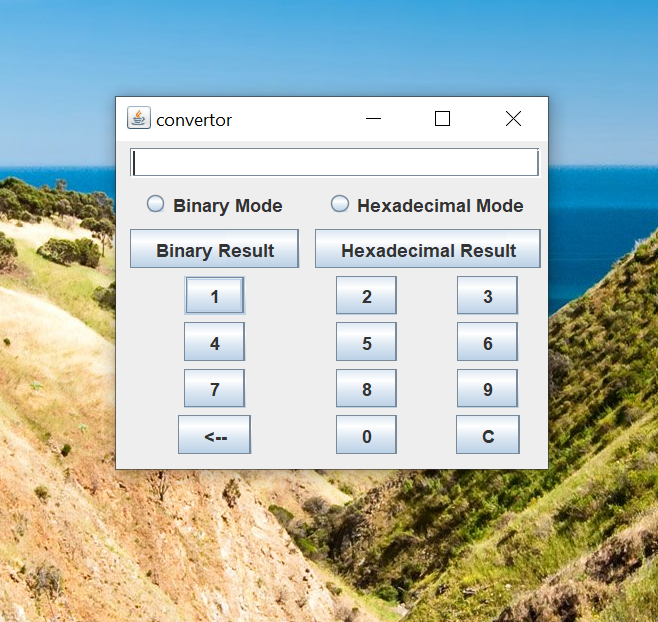
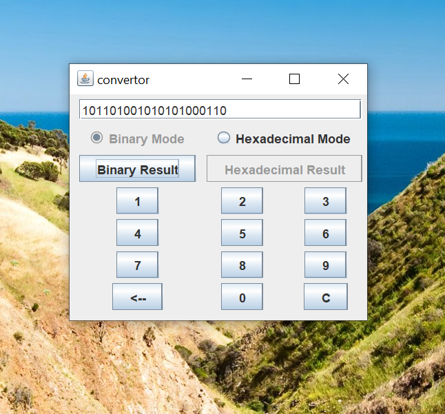

# Repository Management Software

## Getting Started

## Features
- It pops as a small box on a screen so other apps and sites can easily be used in computer using the converter at the same time
- It can give the binary of any number.
- It can give the hexadecimal of any number

## Contributers
Made my Abhinav Goel (https://github.com/abhinav2401) 
contributors:
1) Jyotirmay Jain (https://github.com/jyotirmay27)

## Screenshots

  
  

  

  

  
  

 
