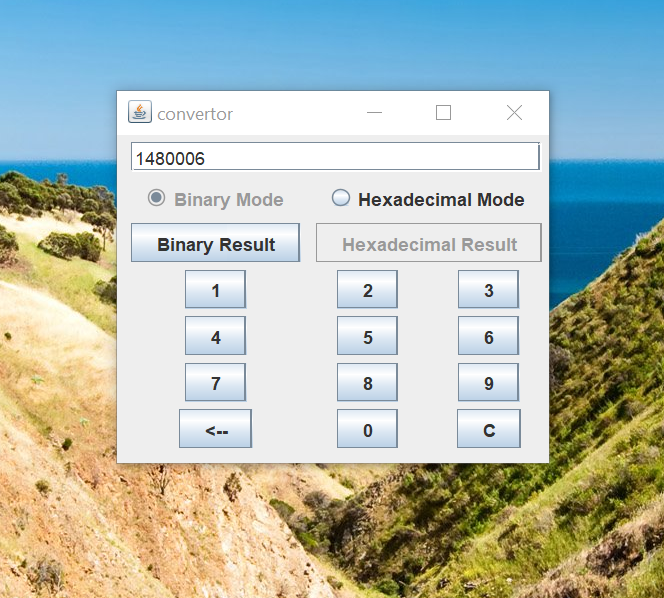

# Decimal to Binary and Hexadecimal Convertor

## Features
- It pops as a small box on a screen so other apps and sites can easily be used in computer using the converter at the same time
- It can give the binary of any  decimal number.
- It can give the hexadecimal of any decimal number

## Contributors
Made my Abhinav Goel (https://github.com/abhinav2401) 

## Screenshots

  
  

  

  

  
  

 
